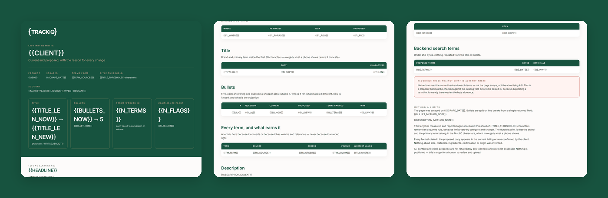

# TrackIQ: Amazon Listing Optimizer

The catalogue is full of skills that measure. **This one writes the fix.**

One ASIN in, a rewritten title, five bullets, a description and backend terms out — each change traced to a search term that earns it or a question it answers.

Part of **Amazon Listing Management & Optimization** in the
[TrackIQ skills catalog](https://github.com/TrackIQ-HQ/amazon-seller-skills).

Built as an [Agent Skill](https://code.claude.com/docs/en/skills). Runs in
Claude Code, Claude web, Claude desktop and ChatGPT from the same folder.

---

## ⚠ This skill needs a scraper connection

Part of what this reads only exists on the public product page, so it needs an
**Oxylabs scraper** connection alongside the TrackIQ MCP. Scraper calls cost
credits per ASIN or keyword per run, and the skill states the run's cost in its
output.

There is no first-party substitute for the scraped fields — the skill says so
rather than approximating them.

---

## Powered by the TrackIQ MCP

[](https://trackiq.com/mcp)

This skill reads your live Amazon account through the
**[TrackIQ MCP](https://trackiq.com/mcp)** — 16 tools connecting your AI
assistant to Amazon data:

Sales & Traffic · Orders · Inventory · Returns · Sponsored Products · Sponsored
Brands · Sponsored Display · Amazon DSP · AMC Cloud · Keywords · Search Terms ·
Targeting · Search Query Performance · Organic Rank · Best Seller Rank · Buy Box
History · Brand Analytics · Export

Works with Claude, ChatGPT and Cursor. **[Get access →](https://trackiq.com/mcp)**

---

## What you get



Rewrites one Amazon listing — title, bullets, description and backend terms — against the terms it should rank for and the questions shoppers actually ask, producing a side-by-side of current and proposed copy with the reason for every change. Built for how Amazon matches intent and answers questions in 2026, not for keyword stuffing. Use when the user asks to optimise a listing, rewrite a title or bullets, improve a product page, listing copy, Rufus or COSMO readiness, or how to make a listing rank better.

### The rules that keep it honest

- **`bullet_points` is one newline-joined string, not a list**
- **`description` is not the description**
- **There are no backend search terms in any tool**
- **Measure the title, do not assert a rule**

The full list is in `SKILL.md`, and each one exists because getting it wrong
produces a confident, wrong answer rather than an obvious error.

## Requirements

- **The Oxylabs scraper**, for `get_product` and `get_reviews` — the live page and what buyers say about it. - The TrackIQ MCP, for `list_marketplaces`, `get_search_query_performance` and `get_search_terms` — the terms worth ranking for and the ones that already convert. - Nothing else. No filesystem, no shell. - **Without the MCP:** works from the live page plus a keyword list the user supplies. Without Oxylabs it cannot see the page and should not guess — ask the user to paste the current title, bullets and description.

---

## Install

### Claude Code

```
/plugin marketplace add TrackIQ-HQ/amazon-seller-skills
/plugin install trackiq-amazon-listing-optimizer@trackiq
```

### Claude web, desktop, mobile

1. Download the `.zip` from the
   [latest release](https://github.com/TrackIQ-HQ/trackiq-amazon-listing-optimizer/releases)
2. **Settings → Capabilities → Skills** (code execution must be on)
3. **Create skill → Upload a skill**, choose the `.zip`
4. Toggle it on

### ChatGPT

Same zip. **Plugins → Skills → Create → Upload from your computer.**

---

## Setup

Answers live in `account.md`, copied from
[`assets/account.example.md`](skills/trackiq-amazon-listing-optimizer/assets/account.example.md).
**Every TrackIQ skill reads the same file**, so an account already set up for
another TrackIQ report needs nothing added.

## Delivery

Asked once and stored in `account.md`: **in-chat** (default), **file**,
**Slack**, **n8n** or **email**. Anything leaving the chat confirms with you
first and falls back to in-chat, with a note.

---

## Customizing

| File | What it controls |
|---|---|
| `checks.md` | the pre-send checks |
| `document-template.html` | the report shell |
| `fields.md` | reference detail |
| `method.md` | the method and every threshold |

---

## Contributing

```bash
python scripts/validate.py    # must exit 0 before any commit
python scripts/build.py       # writes dist/ zip + registry.json
```

Read [AUTHORING.md](https://github.com/TrackIQ-HQ/amazon-seller-skills/blob/main/AUTHORING.md)
before proposing changes.

## License

MIT. See [LICENSE](LICENSE).
